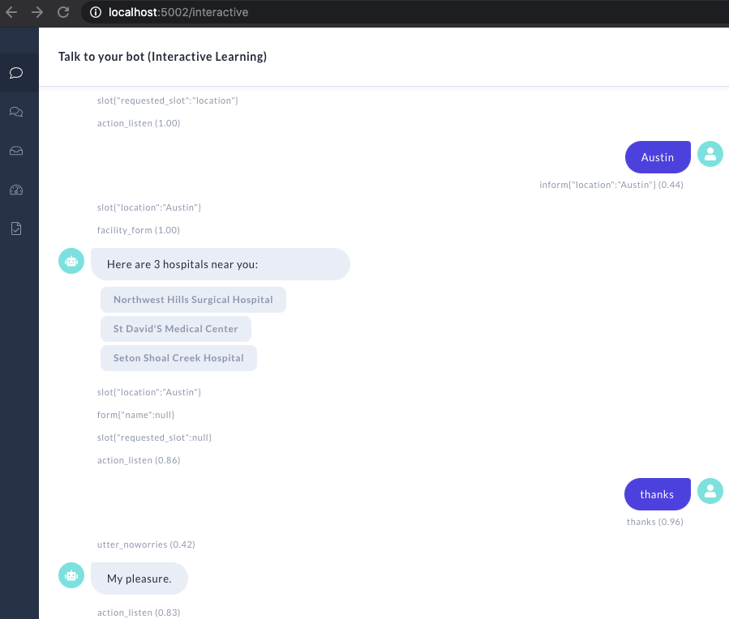

# Medical Locator - code in the Rasa Master Class

## What do you need to get this up & running

If you have not, you should have Rasa & Rasa X installed on your machine:  
```pip install rasa-x --extra-index-url https://pypi.rasa.com/simple```

## How do I use this repo?
Train the assistant using the command:  
`rasa train`

Test the assistant using the command:  
`rasa x`

## Expected Result
Once you get your model trained, you can use `rasa x` interactive learning feature to make sure it works. Here is a screenshot which can be used as an example



